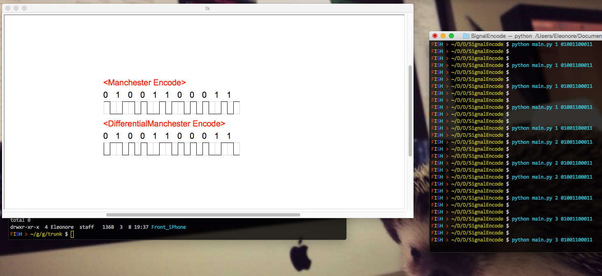
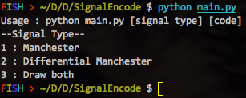

# SignalEncodePy

Visual signal encoding with python

Now, only Manchester encoding, Differential manchester ecnoding implemented.

#Requirements
python 2.7+

#Usage

In terminal window, 
run main.py with params.

  $ python main.py [signal type] [code]

For example, 

  $ python main.py 3 01001100011

==NOTE==

if you type invalid param, it will print usage code :

